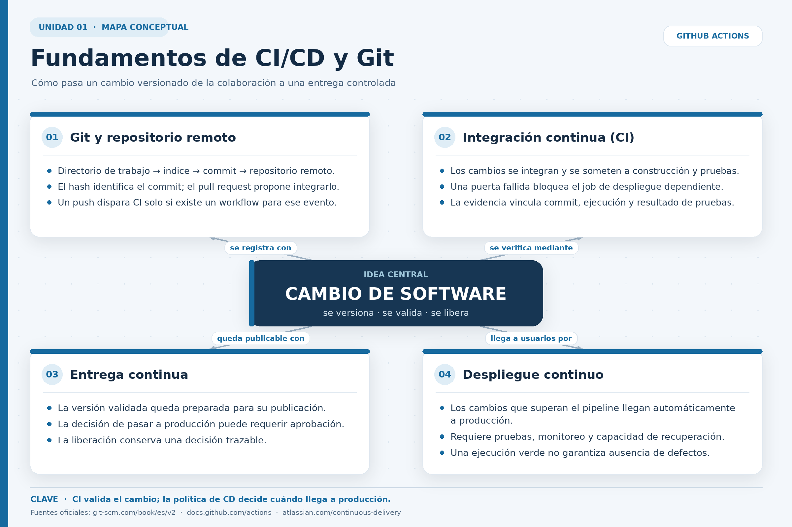
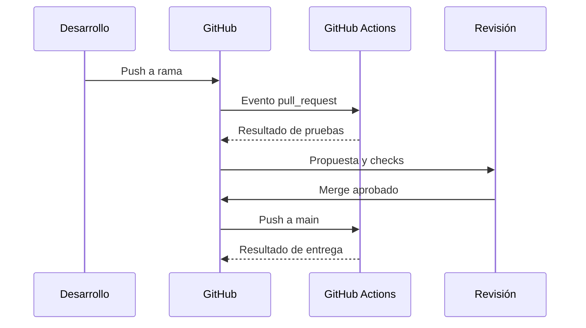
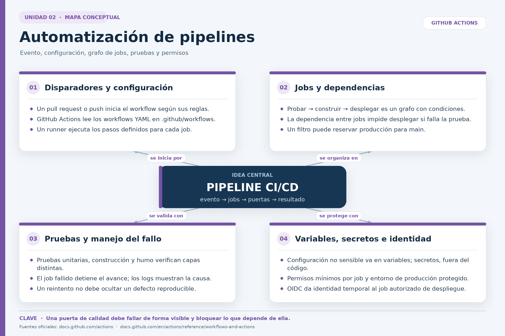

# Despliegues continuos: fundamentos, pipelines y nube

Tres unidades conectadas por un ejemplo común: una API `demo-ci-cd`, alojada en GitHub, verificada con GitHub Actions y desplegada en Cloud Run. Los fragmentos de YAML son ejemplos explicativos; su ejecución requiere que existan la aplicación, las pruebas, un `Dockerfile` y la configuración de identidad y permisos.

## Contenido

1. [Unidad 1. Fundamentos de CI/CD y control de versiones](#unidad-1)
2. [Unidad 2. Automatización de pipelines de CI/CD](#unidad-2)
3. [Unidad 3. Despliegue de aplicaciones en la nube](#unidad-3)

<a id="unidad-1"></a>
## Unidad 1. Fundamentos de CI/CD y control de versiones



### 1.1. De un cambio de código a una entrega verificable

Un cambio pasa por decisiones distintas: **registrarlo**, **integrarlo**, **verificarlo** y, cuando corresponde, **ponerlo a disposición de usuarios**. Git registra la historia; GitHub facilita la colaboración; GitHub Actions ejecuta verificaciones y despliegues definidos como workflows. Estos componentes se complementan, pero no son sinónimos. [GitHub Docs: acerca de Git](https://docs.github.com/es/get-started/using-git/about-git) · [GitHub Docs: workflows](https://docs.github.com/en/actions/concepts/workflows-and-actions/workflows).

| Concepto | Pregunta que responde | Evidencia observable |
|---|---|---|
| **Integración continua (CI)** | ¿El cambio se integra con frecuencia y supera las verificaciones automáticas? | Una ejecución informa si las pruebas y la construcción tuvieron éxito o fallaron. |
| **Entrega continua** | ¿El cambio validado queda en condiciones de publicarse mediante una decisión controlada? | Versión verificable y proceso de publicación definido; puede existir aprobación previa. |
| **Despliegue continuo** | ¿Cada cambio que supera las puertas definidas se publica automáticamente? | El pipeline despliega tras las verificaciones según su política configurada. |

La sigla «CD» puede significar *continuous delivery* o *continuous deployment*. Aquí se escribe el término completo cuando importa la diferencia. Si producción exige una aprobación humana, hay una puerta de entrega, aunque el despliegue posterior esté automatizado. La configuración concreta del entorno determina el comportamiento. [GitHub Docs: entornos y protecciones](https://docs.github.com/en/actions/reference/workflows-and-actions/deployments-and-environments).

Un estado verde indica que pasó **las comprobaciones programadas**. No garantiza que la aplicación esté libre de errores fuera de la cobertura de esas pruebas.

### 1.2. Control de versiones con Git y repositorios remotos

Git es un sistema de control de versiones distribuido. Un repositorio remoto en GitHub permite publicar commits y coordinar propuestas, revisiones y verificaciones. [GitHub Docs: Git](https://docs.github.com/es/get-started/using-git/about-git) · [GitHub Docs: repositorios remotos](https://docs.github.com/en/get-started/git-basics/about-remote-repositories).

| Elemento | Significado | Ejemplo de la API |
|---|---|---|
| **Commit** | Registro identificable de cambios. | Se añade una corrección y su prueba. |
| **Rama** | Línea de trabajo que aísla una propuesta. | `mejora-inventario` se desarrolla sin alterar inmediatamente `main`. |
| **Push** | Publicación de commits en el remoto. | La rama actualizada llega a GitHub. |
| **Pull request** | Propuesta de integrar cambios entre ramas. | El equipo revisa código y checks. |
| **Merge** | Integración de la propuesta en la rama destino. | La corrección pasa a `main`. |
| **SHA del commit** | Identificador del estado de código usado por la ejecución. | Una revisión puede relacionarse con el commit que la originó. |

El SHA permite reconstruir **qué código** se probó. Si además se incorpora a la configuración de la revisión desplegada, facilita investigar qué versión atendió una solicitud. [GitHub Docs: contexto `github`](https://docs.github.com/en/actions/reference/workflows-and-actions/contexts).

### 1.3. Flujo básico de CI/CD en GitHub Actions

Un `pull_request` puede disparar CI; un `push` a `main` puede disparar una nueva validación y luego el despliegue. Los checks y las aprobaciones **no se vuelven obligatorios por crear el workflow**: la protección de rama y del entorno debe configurarse. [GitHub Docs: eventos](https://docs.github.com/en/actions/reference/workflows-and-actions/events-that-trigger-workflows) · [GitHub Docs: checks requeridos](https://docs.github.com/en/pull-requests/reference/status-checks).



**Ejemplo.** Un cambio en `/api/inventario` abre un pull request. GitHub Actions ejecuta las pruebas. Si una falla, el log identifica el paso y el caso de prueba. Una corrección en un nuevo commit desencadena otra ejecución. Si el check `test` es obligatorio para la rama, su fallo impide el merge por esa regla. Tras integrar el cambio, `push` a `main` puede iniciar el flujo de entrega. [GitHub Docs: logs](https://docs.github.com/en/actions/how-tos/monitor-workflows/use-workflow-run-logs).

### 1.4. Beneficios y límites

| Beneficio esperado | Mecanismo | Límite |
|---|---|---|
| Retroalimentación temprana | Pruebas automáticas ante cambios propuestos. | Una prueba ausente no detecta lo que no cubre. |
| Repetibilidad | Workflow versionado con runner, acciones y comandos. | Dependencias externas pueden introducir variación. |
| Trazabilidad | Evento y commit asociados a la ejecución. | También debe conservarse la relación con la revisión desplegada. |
| Menos operaciones manuales | Pasos definidos y ejecutados en secuencia. | Seguridad, cobertura y respuesta a fallas requieren decisiones humanas. |

**Síntesis.** Git conserva la historia; GitHub coordina la revisión; GitHub Actions convierte eventos en verificaciones y entregas. Un resultado exitoso es evidencia delimitada, no una garantía absoluta.

**Fuentes oficiales:** [Git y GitHub](https://docs.github.com/es/get-started/using-git/about-git), [workflows](https://docs.github.com/en/actions/concepts/workflows-and-actions/workflows), [eventos](https://docs.github.com/en/actions/reference/workflows-and-actions/events-that-trigger-workflows), [checks](https://docs.github.com/en/pull-requests/reference/status-checks).

<a id="unidad-2"></a>
## Unidad 2. Automatización de pipelines de CI/CD



### 2.1. Anatomía de un pipeline

Un **pipeline** organiza tareas automáticas y dependencias. En GitHub Actions, el **workflow** es un YAML ubicado en `.github/workflows/`. Un **evento** inicia la ejecución; el workflow contiene **jobs**; cada job corre en un **runner** y ejecuta **steps**. Un step invoca una acción con `uses` o un comando con `run`. Los jobs independientes pueden ejecutarse en paralelo; `needs` expresa una dependencia. [GitHub Docs: workflows](https://docs.github.com/en/actions/concepts/workflows-and-actions/workflows) · [GitHub Docs: sintaxis](https://docs.github.com/en/actions/reference/workflows-and-actions/workflow-syntax).

| Pieza | Clave típica | Función |
|---|---|---|
| Evento | `on:` | Determina cuándo se inicia. |
| Job | `jobs.test` | Agrupa pasos con un resultado propio. |
| Runner | `runs-on: ubuntu-24.04` | Proporciona el entorno donde corre el job. |
| Paso | `steps:` | Ejecuta una acción o un comando. |
| Dependencia | `needs: test` | Espera el resultado del job indicado. |
| Condición | `if:` | Restringe el job según el evento o contexto. |
| Entorno | `environment: production` | Asocia variables y protecciones si están configuradas. |

Los pasos de un mismo job comparten espacio de trabajo, pero **dos jobs en runners distintos no comparten automáticamente sus archivos**. Para trasladar resultados puede usarse un artefacto con `upload-artifact` y `download-artifact`. Una caché sirve para acelerar dependencias; no reemplaza al artefacto que se necesita conservar o transferir. [GitHub Docs: artefactos](https://docs.github.com/en/actions/tutorials/store-and-share-data) · [GitHub Docs: caché](https://docs.github.com/en/actions/concepts/workflows-and-actions/dependency-caching).

### 2.2. Ejemplo de integración continua en GitHub Actions

Este ejemplo supone un proyecto Python con carpeta `tests/` y `Dockerfile`. Corre en pull requests y en pushes a `main`. La imagen `demo-ci-cd:ci` queda en el runner; **no se publica** en un registro. [GitHub Docs: sintaxis del workflow](https://docs.github.com/en/actions/reference/workflows-and-actions/workflow-syntax).

```yaml
name: CI - API demo
on:
  pull_request:
  push:
    branches: [main]

permissions:
  contents: read

jobs:
  test:
    runs-on: ubuntu-24.04
    steps:
      - uses: actions/checkout@v6
        with:
          persist-credentials: false
      - uses: actions/setup-python@v6
        with:
          python-version: '3.12'
      - name: Pruebas unitarias
        run: python -m unittest discover -s tests -v
      - name: Construir imagen
        run: docker build -t demo-ci-cd:ci .
```

| Fragmento | Interpretación |
|---|---|
| `on:` | Declara los eventos. El filtro de rama mostrado corresponde al evento `push`. |
| `permissions: contents: read` | Concede lectura del repositorio al `GITHUB_TOKEN` del workflow. |
| `checkout@v6` | Descarga el commit de la ejecución al runner. |
| `persist-credentials: false` | Evita persistir la credencial de checkout en la configuración local de Git. |
| `setup-python@v6` | Selecciona Python 3.12. |
| `unittest` | Ejecuta pruebas; un fallo marca el paso y el job como fallidos. |
| `docker build` | Comprueba que el contexto y el `Dockerfile` permiten construir una imagen local. |

La **sangría YAML** expresa pertenencia: `steps` está dentro de `test`; cada `with` pertenece a la acción previa. Las expresiones `${{ ... }}` del ejemplo de nube son evaluadas por GitHub Actions en los contextos permitidos; no son variables de shell. [GitHub Docs: expresiones](https://docs.github.com/en/actions/concepts/workflows-and-actions/expressions).

### 2.3. Pruebas, puertas de calidad y errores

Una **puerta de calidad** define qué resultados deben cumplirse antes de avanzar. Un job posterior con `needs: test` normalmente no avanza cuando `test` falla. El estado general señala el resultado; el **log del paso** ayuda a encontrar la causa. [GitHub Docs: jobs](https://docs.github.com/en/actions/how-tos/write-workflows/choose-what-workflows-do/use-jobs) · [GitHub Docs: logs](https://docs.github.com/en/actions/how-tos/monitor-workflows/use-workflow-run-logs).

| Verificación | Evidencia que aporta | Lo que no prueba |
|---|---|---|
| Pruebas unitarias | Comportamiento cubierto por los casos escritos. | Rutas o dependencias no contempladas. |
| `docker build` | Capacidad de construir el contenedor en CI. | Identidad binaria con otra imagen construida después. |
| Prueba de humo de `/health` | Respuesta mínima de un contenedor en ese entorno. | Corrección funcional completa. |
| Check obligatorio de rama | Un merge condicionado a un resultado configurado. | Ausencia de defectos fuera de las pruebas. |

**Ejemplo de diagnóstico.** Si `unittest` pasa y `docker build` falla porque falta un archivo copiado por el `Dockerfile`, la falla pertenece al empaquetado. Si el job `deploy` aparece omitido, se examinan `if` y `needs`; si falla la autenticación cloud, se separa el problema de identidad del permiso sobre el recurso. [GitHub Docs: condiciones de jobs](https://docs.github.com/en/actions/how-tos/monitor-workflows/view-job-condition-logs).

### 2.4. Variables, secretos y permisos

| Mecanismo | Ejemplo | Uso |
|---|---|---|
| Variable de configuración | `vars.GCP_REGION` | Dato no sensible definido para repositorio o entorno. |
| Variable de proceso | `env: GCP_REGION: ...` | Nombre que recibe un comando del job o step. |
| Secreto | `secrets.API_TOKEN` | Valor sensible que no debe escribirse en el YAML ni imprimirse en logs. |
| Token de GitHub | `contents: read` | Permiso mínimo para leer el repositorio. |
| OIDC | `id-token: write` en `deploy` | Permite solicitar un token para federar identidad con la nube. |

OIDC evita guardar una clave cloud de larga duración en GitHub cuando el proveedor admite federación. `id-token: write` **no concede por sí solo acceso cloud**: el proveedor debe confiar en la identidad de GitHub y autorizarla en IAM. Mantener ese permiso únicamente en el job que despliega reduce su alcance. [GitHub Docs: variables](https://docs.github.com/en/actions/reference/workflows-and-actions/variables) · [GitHub Docs: secretos](https://docs.github.com/en/actions/how-tos/write-workflows/choose-what-workflows-do/use-secrets) · [GitHub Docs: OIDC](https://docs.github.com/en/actions/how-tos/secure-your-work/security-harden-deployments/oidc-in-cloud-providers).

**Síntesis.** El pipeline es un grafo de eventos, jobs, condiciones y permisos. El YAML declara lo esperado; el resultado y los logs revelan qué ocurrió realmente.

**Fuentes oficiales:** [sintaxis de GitHub Actions](https://docs.github.com/en/actions/reference/workflows-and-actions/workflow-syntax), [artefactos](https://docs.github.com/en/actions/tutorials/store-and-share-data), [variables](https://docs.github.com/en/actions/reference/workflows-and-actions/variables), [secretos](https://docs.github.com/en/actions/how-tos/write-workflows/choose-what-workflows-do/use-secrets), [logs](https://docs.github.com/en/actions/how-tos/monitor-workflows/use-workflow-run-logs).

<a id="unidad-3"></a>
## Unidad 3. Despliegue de aplicaciones en la nube


### 3.1. Infraestructura cloud y servicios de una aplicación web

Una aplicación web necesita cómputo, red, almacenamiento, identidad y observabilidad. En el ejemplo, **Cloud Run** ejecuta el contenedor; GitHub Actions coordina CI y el despliegue; otros servicios de Google Cloud construyen, almacenan y observan la imagen. Usar un servicio administrado no elimina la responsabilidad sobre el código, permisos, configuración y comportamiento. [Google Cloud: opciones de despliegue](https://docs.cloud.google.com/run/docs/deployment-options-for-services).

| Componente | Responsabilidad | Evidencia |
|---|---|---|
| GitHub | Conserva commits, pull requests y workflow. | SHA y checks. |
| GitHub Actions | Ejecuta `test` y condiciona `deploy`. | Jobs y logs. |
| WIF e IAM | Establecen confianza y permisos para el despliegue. | Identidad autorizada. |
| Cloud Build y Artifact Registry | Construyen y almacenan la imagen desde fuente. | Build e imagen resultante. |
| Cloud Run | Crea revisiones y atiende tráfico. | Revisión y distribución de solicitudes. |
| Cloud Logging y Monitoring | Muestran logs y métricas. | Errores, solicitudes y latencia. |

Con `gcloud run deploy --source .`, Cloud Run usa una construcción desde fuente: Cloud Build produce la imagen y Artifact Registry la almacena. Con un `Dockerfile` adecuado, la construcción puede usarlo. La imagen de `docker build` en CI y la imagen creada por Cloud Build son **construcciones diferentes**. Si se exige identidad exacta del artefacto, el diseño debe construir una imagen una sola vez, publicarla y desplegarla por digest. [Google Cloud: desplegar desde fuente](https://docs.cloud.google.com/run/docs/deploying-source-code).

### 3.2. Desplegar, liberar y recuperar

Un **despliegue** crea una revisión con imagen y configuración; la **liberación** define qué tráfico recibe. Pueden ocurrir juntos o separarse en un lanzamiento gradual. Un rollback puede devolver tráfico a una revisión anterior sin borrar ni revertir el commit de Git. [Google Cloud: revisiones](https://docs.cloud.google.com/run/docs/managing/revisions) · [Google Cloud: rollouts y rollback](https://docs.cloud.google.com/run/docs/rollouts-rollbacks-traffic-migration).

| Estado | Interpretación precisa |
|---|---|
| Pruebas de Actions aprobadas | La versión superó las verificaciones definidas. |
| Imagen construida | Existe un artefacto; no implica servicio disponible. |
| Revisión lista | La plataforma preparó la versión para servir. |
| Tráfico asignado | Las solicitudes se enrutan hacia esa revisión. |
| Servicio funcionando para usuarios | Requiere observar respuestas, errores, latencia y funciones críticas. |

### 3.3. Ejemplo de despliegue condicionado con GitHub Actions

Este bloque es el job `deploy` **dentro del mismo `jobs:`** del workflow de la unidad 2; depende del job `test`. Solo despliega con un `push` a `main` cuando `test` termina correctamente. `production` puede imponer una aprobación si se configura esa protección. Los nombres `GCP_PROJECT_ID`, `WIF_PROVIDER`, `DEPLOY_SERVICE_ACCOUNT`, `GCP_REGION` y `RUNTIME_SERVICE_ACCOUNT` representan variables configuradas en GitHub; la confianza WIF y los permisos IAM existen previamente en Google Cloud. [GitHub Docs: entornos](https://docs.github.com/en/actions/reference/workflows-and-actions/deployments-and-environments) · [Google Cloud: WIF](https://docs.cloud.google.com/iam/docs/workload-identity-federation-with-deployment-pipelines).

```yaml
  deploy:
    if: github.event_name == 'push' && github.ref == 'refs/heads/main'
    needs: test
    runs-on: ubuntu-24.04
    environment: production
    permissions:
      contents: read
      id-token: write
    steps:
      - uses: actions/checkout@v6
        with:
          persist-credentials: false
      - uses: google-github-actions/auth@v3
        with:
          project_id: ${{ vars.GCP_PROJECT_ID }}
          workload_identity_provider: ${{ vars.WIF_PROVIDER }}
          service_account: ${{ vars.DEPLOY_SERVICE_ACCOUNT }}
      - uses: google-github-actions/setup-gcloud@v3
      - name: Desplegar desde fuente
        env:
          GCP_PROJECT_ID: ${{ vars.GCP_PROJECT_ID }}
          GCP_REGION: ${{ vars.GCP_REGION }}
          RUNTIME_SERVICE_ACCOUNT: ${{ vars.RUNTIME_SERVICE_ACCOUNT }}
          APP_VERSION: ${{ github.sha }}
        run: |
          gcloud run deploy demo-ci-cd \
            --source . \
            --project="$GCP_PROJECT_ID" \
            --region="$GCP_REGION" \
            --service-account="$RUNTIME_SERVICE_ACCOUNT" \
            --set-env-vars="APP_VERSION=$APP_VERSION" \
            --quiet
```

| Decisión | Motivo |
|---|---|
| `if` y `needs: test` | Restringen el evento y exigen CI exitosa. |
| `environment: production` | Asocia variables y protecciones definidas para el entorno. |
| `id-token: write` solo en `deploy` | Habilita OIDC en el job que lo necesita. |
| `auth@v3` con WIF y cuenta desplegadora | Obtiene identidad cloud sin una clave JSON permanente en el workflow. |
| `--source .` | Construye desde el código del commit. |
| `--service-account` | Asigna la identidad de ejecución de la API, distinta de la desplegadora. |
| `APP_VERSION=github.sha` | Relaciona la configuración de la revisión con el commit. |

El ejemplo presupone aplicación, pruebas, `Dockerfile`, proyecto y política de identidad configurados. El archivo de credenciales temporal de la acción de autenticación debe excluirse del contexto de fuente enviado a construir, por ejemplo mediante `.gcloudignore`; no debe versionarse. Una referencia a `production` tampoco implica que se haya configurado aprobación. [Acción oficial de autenticación](https://github.com/google-github-actions/auth) · [Acción oficial de gcloud](https://github.com/google-github-actions/setup-gcloud).

### 3.4. Seguridad: dos identidades y un límite de confianza

La cuenta **desplegadora** es asumida temporalmente por GitHub Actions y necesita permisos para publicar. La cuenta **de ejecución** se asigna al servicio Cloud Run y determina a qué recursos puede acceder la aplicación al funcionar. La confianza WIF debe limitarse a repositorios y referencias o entornos autorizados. `id-token: write` por sí solo no da permisos en Google Cloud. [GitHub Docs: OIDC](https://docs.github.com/en/actions/how-tos/secure-your-work/security-harden-deployments/oidc-in-cloud-providers) · [Google Cloud: WIF para pipelines](https://docs.cloud.google.com/iam/docs/workload-identity-federation-with-deployment-pipelines).

También se decide **quién puede invocar** la API. Publicar una revisión no equivale a autorizar acceso anónimo; exposición pública, secretos de aplicación e identidad de ejecución son decisiones separadas del éxito del job `deploy`. [Google Cloud: autenticación entre servicios](https://docs.cloud.google.com/run/docs/authenticating/service-to-service).

### 3.5. Monitoreo básico y recuperación

Actions informa si el workflow avanzó. Cloud Run, Cloud Logging y Cloud Monitoring ayudan a observar qué sucede **después**: solicitudes, errores, latencia, revisiones y registros de la aplicación. Un check verde no reemplaza las señales del servicio que recibe tráfico. [GitHub Docs: logs](https://docs.github.com/en/actions/how-tos/monitor-workflows/use-workflow-run-logs) · [Google Cloud: monitoreo](https://docs.cloud.google.com/run/docs/monitoring) · [Google Cloud: logging](https://docs.cloud.google.com/run/docs/logging).

| Señal | Interpretación posible | Límite |
|---|---|---|
| Revisión lista | La plataforma preparó esa versión. | No verifica todos los recorridos funcionales. |
| `/health` responde 200 | Se cumple la condición definida por esa ruta. | Puede no probar dependencias críticas. |
| Aumento de 5xx | Hay fallas al atender solicitudes. | Requiere correlación con logs y tráfico. |
| Aumento de latencia | Las respuestas tardan más. | Puede depender de carga, código o servicios externos. |
| Logs de la revisión | Muestran eventos de esa versión. | Un evento aislado no demuestra la causa general. |

**Ejemplo de recuperación.** Si una revisión nueva presenta errores sostenidos, puede reasignarse el tráfico a una revisión anterior. Después se observan nuevamente errores, latencia y funciones críticas. El código problemático sigue en Git y exige corrección; un despliegue posterior puede modificar otra vez el tráfico. [Google Cloud: rollback y migración de tráfico](https://docs.cloud.google.com/run/docs/rollouts-rollbacks-traffic-migration).

**Síntesis.** El despliegue combina artefacto, identidad, configuración, revisión, tráfico y observabilidad. GitHub Actions coordina el proceso; la nube construye y ejecuta; los resultados de CI y las señales operativas responden preguntas distintas.

**Fuentes oficiales:** [Cloud Run desde fuente](https://docs.cloud.google.com/run/docs/deploying-source-code), [revisiones](https://docs.cloud.google.com/run/docs/managing/revisions), [rollback](https://docs.cloud.google.com/run/docs/rollouts-rollbacks-traffic-migration), [monitoreo](https://docs.cloud.google.com/run/docs/monitoring), [WIF](https://docs.cloud.google.com/iam/docs/workload-identity-federation-with-deployment-pipelines), [acción `auth`](https://github.com/google-github-actions/auth), [acción `setup-gcloud`](https://github.com/google-github-actions/setup-gcloud).

